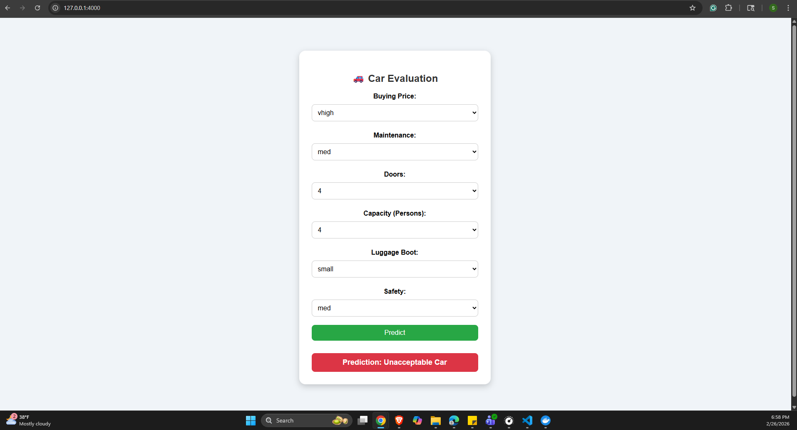
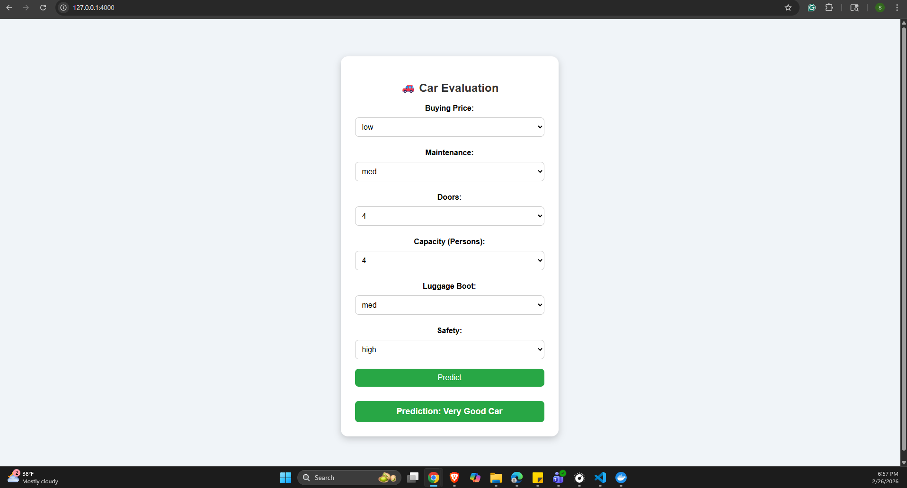
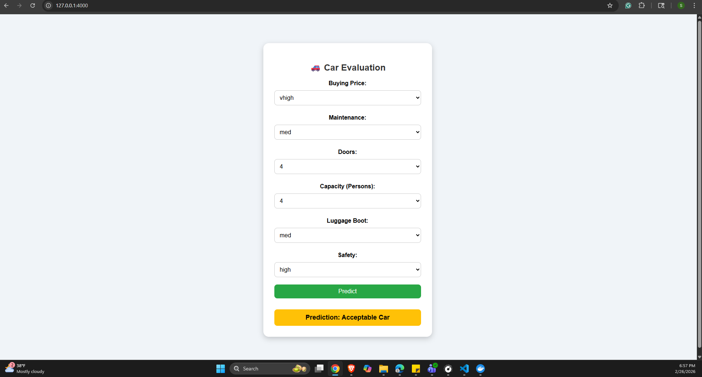

# Car Evaluation Prediction Application

A production-ready Flask web application for predicting car evaluations using a pre-trained Decision Tree Classifier. Built as part of the Northeastern University MSCS MLOps Lab, this project demonstrates containerization and deployment of machine learning models.

## 📋 Project Overview

**Tech Stack:**
- **Flask 2.3.3** - Web framework for API and UI
- **scikit-learn 1.7.2** - Decision Tree Classifier model
- **joblib 1.3.2** - Model & encoder serialization
- **pandas 2.1.1** - Data manipulation
- **numpy 1.26.4** - Numerical computing
- **Docker** - containerization
- **Jinja2 Templates** - HTML rendering with dynamic dropdowns

**Dataset:** UCI Car Evaluation Dataset

**Model:** Trained Decision Tree Classifier that predicts car ratings (`unacc`, `acc`, `good`, `vgood`) based on 6 features: buying, maintenance, doors, persons, luggage boot, and safety.

---

## 📁 Project Structure

```
MLOps_Docker/
├── Dockerfile                          # Container definition
├── requirements.txt                    # Python dependencies with exact versions
├── README.md                           # This file
├── src/
│   ├── app.py                         # Flask application with dynamic encoding
│   ├── train_model.py                 # Model training script
│   └── templates/
│       └── predict.html               # HTML form with dynamic dropdowns
├── artifacts/
│   ├── model.pkl                      # Serialized Decision Tree model
│   └── encoders.pkl                   # Serialized LabelEncoders for all features
└── Screenshots/
    ├── image43.png                    # Home page form
    ├── image.png                      # Prediction results
    ├── image435.png                   # Docker container logs
    └── image467.png                   # Docker build output
```

---

## 🚀 Setup Instructions

### Prerequisites

- **Python 3.10+** (local development)
- **Docker** (for containerization)
- **Git** (to clone the repository)

### Step 1: Clone the Repository

```bash
git clone <your-repo-url>
cd MLOps_Docker
```

### Step 2: Create Virtual Environment

```bash
# On Windows
python -m venv venv
venv\Scripts\activate

# On macOS/Linux
python -m venv venv
source venv/bin/activate
```

### Step 3: Install Dependencies

```bash
pip install -r requirements.txt
```

**Requirements Include:**
- Flask: Web framework
- scikit-learn: ML model
- pandas & numpy: Data processing
- joblib: Model serialization

---

## 💻 Running Locally

### Start the Flask Application

```bash
cd src
python app.py
```

**Expected Output:**
```
 * Running on http://0.0.0.0:4000
 * Debug mode: on
```

### Access the Application

Open your browser and navigate to:
```
http://localhost:4000
```

### How It Works

1. **Form Submission:** Select car features from dynamically generated dropdowns
2. **Encoding:** Input values are encoded using the saved `LabelEncoder` objects from `artifacts/encoders.pkl`
3. **Prediction:** The encoded data is passed to the pre-trained model
4. **Result:** The predicted rating is decoded and displayed with a color-coded background

**Sample Test:**
- Buying: `low`
- Maintenance: `low`
- Doors: `4`
- Persons: `4`
- Luggage Boot: `big`
- Safety: `high`

**Expected Output:** "Very Good Car" ✅

### Troubleshooting Local Execution

| Error | Solution |
|-------|----------|
| `ModuleNotFoundError: No module named 'flask'` | Run `pip install -r requirements.txt` |
| `FileNotFoundError: model.pkl` | Ensure `artifacts/` folder exists with both `.pkl` files |
| `ValueError: numpy.dtype size changed` | Run `pip install --force-reinstall -r requirements.txt` |
| Port 4000 already in use | Change `port=4000` in `app.py` to a different port |

---

## 🐳 Docker Setup

### Understanding Docker Storage

When you build a Docker image, it is **stored locally on your system** in Docker's internal storage location:

| OS | Storage Location |
|----|----|
| **Windows** | `C:\ProgramData\Docker` (Docker Desktop) or WSL2 ext4.vhdx |
| **macOS** | `~/.docker/` or `/var/lib/docker/` (Docker Desktop) |
| **Linux** | `/var/lib/docker/` |

**To check local images:**
```bash
docker images
```

**To see image details:**
```bash
docker inspect car-evaluation-app
```

### Build the Docker Image

```bash
docker build -t car-evaluation-app .
```

**What this does:**
1. Uses `Dockerfile` from the root directory
2. Sets base image: `python:3.10-slim`
3. Installs dependencies from `requirements.txt`
4. Copies source code, artifacts, and templates
5. Creates image tagged as `car-evaluation-app`
6. Stores image locally in Docker's storage location

**Build output example:**
```
Sending build context to Docker daemon  245.2kB
Step 1/8 : FROM python:3.10-slim
...
Successfully built abc123def456
Successfully tagged car-evaluation-app:latest
```

### Run the Docker Container

```bash
docker run -p 4000:4000 car-evaluation-app
```

**Options:**
- `-p 4000:4000` - Maps host port 4000 → container port 4000
- `-d` - Run in detached mode (background)
- `--name car-app` - Assign container name

**Full example (detached):**
```bash
docker run -d -p 4000:4000 --name car-app car-evaluation-app
```

### Push to Docker Hub

To store your image in the cloud for future use:

```bash
# Login to Docker Hub
docker login

# Tag the image
docker tag car-evaluation-app <your-dockerhub-username>/car-evaluation-app:latest

# Push to Docker Hub
docker push <your-dockerhub-username>/car-evaluation-app:latest

# Verify it's stored
# Visit: https://hub.docker.com/r/<your-dockerhub-username>/car-evaluation-app
```

### Pull and Run from Docker Hub

```bash
docker pull <your-dockerhub-username>/car-evaluation-app:latest
docker run -p 4000:4000 <your-dockerhub-username>/car-evaluation-app:latest
```

---

## 📸 Screenshots

### 1. Home Page - Feature Selection Form
The form displays dynamic dropdowns generated directly from the saved label encoders, ensuring consistency between training and inference:


**Features shown:**
- Buying Price (vhigh, high, med, low)
- Maintenance Cost (vhigh, high, med, low)
- Doors (2, 3, 4, 5more)
- Person Capacity (2, 4, more)
- Luggage Boot (small, med, big)
- Safety (low, med, high)

### 2. Prediction Result
The application returns color-coded predictions based on the model's output:



**Color coding:**
- 🔴 Red: Unacceptable Car
- 🟡 Yellow: Acceptable Car
- 🔵 Blue: Good Car
- 🟢 Green: Very Good Car

### 3. Docker Container Running
Shows the Flask application successfully started inside a Docker container:



**Console shows:**
- Flask server starting on 0.0.0.0:4000
- Debug mode enabled
- LabelEncoder classes loaded for each feature
- Ready to accept predictions

### 4. Docker Build Process
Demonstrates the multi-step build process creating the image:



**Build steps:**
- Base image download
- Dependency installation
- Source code copying
- Image finalization and tagging

---

## 🔧 API Details

### Prediction Endpoint

**Route:** `POST /`

**Request (Form Data):**
```
buying=low&maint=low&doors=4&persons=4&lug_boot=big&safety=high
```

**Response (HTML):**
```html
<div class="prediction vgood">
    Prediction: Very Good Car
</div>
```

### How Encoding Works

1. **LabelEncoder Loading:** 
   - Each feature has its own `LabelEncoder` saved in `encoders.pkl`
   - Classes are in the same order as training data

2. **Input Encoding:**
   ```python
   le = encoders["buying"]  # Get feature encoder
   encoded_value = le.transform(["low"])[0]  # Returns: 0
   ```

3. **Model Prediction:**
   ```python
   pred = model.predict([[0, 0, 2, 1, 2, 2]])[0]
   ```

4. **Output Decoding:**
   ```python
   encoded_class = encoders["class"].inverse_transform([1])[0]  # Returns: "good"
   ```

---

## 📊 Model Information

**Model Type:** Decision Tree Classifier
**Training Framework:** scikit-learn 1.7.2
**Input Features:** 6
**Output Classes:** 4 (unacc, acc, good, vgood)
**Model Size:** ~50 KB (model.pkl)
**Encoder Size:** ~10 KB (encoders.pkl)

---

## ⚙️ Docker Compose (Optional)

To run with simplified commands, create a `docker-compose.yml`:

```yaml
version: '3.8'
services:
  car-app:
    build: .
    ports:
      - "4000:4000"
    environment:
      - FLASK_ENV=production
```

Then run:
```bash
docker-compose up
```

---

## 🐛 Troubleshooting

### Local Issues

| Issue | Fix |
|-------|-----|
| Artifact files missing | Ensure `artifacts/model.pkl` and `artifacts/encoders.pkl` exist |
| Port already in use | Change port in `src/app.py`: `app.run(port=5000)` |
| Encoding error on form submit | Check if features in HTML match `feature_columns` list |

### Docker Issues

| Issue | Fix |
|-------|-----|
| Image build fails | Run `docker build --no-cache -t car-evaluation-app .` |
| Container won't start | Check logs: `docker logs <container-id>` |
| Can't access http://localhost:4000 | Verify port mapping: `docker port <container-id>` |
| Image takes too long to build | Use `.dockerignore` to exclude unnecessary files |

---

## 📝 Notes & Best Practices

- ✅ All dependencies are pinned to exact versions for reproducibility
- ✅ Label encoders are saved alongside the model for consistency
- ✅ Dropdowns are dynamically generated from encoders (no hardcoding)
- ✅ Flask debug mode is enabled for development (disable in production)
- ✅ Docker base image is minimal (`python:3.10-slim`)

---

## 🎯 Future Improvements

- [ ] Add input validation and error handling
- [ ] Implement logging for predictions
- [ ] Add API endpoint returning JSON predictions
- [ ] Deploy to cloud (AWS, GCP, Azure)
- [ ] Add model versioning and A/B testing
- [ ] Implement monitoring and alerting

---

## 📧 Support

For questions or issues, refer to the troubleshooting sections or check application logs for detailed error messages.

---

**Last Updated:** February 26, 2026
**Project:** Northeastern MSCS MLOps Lab

